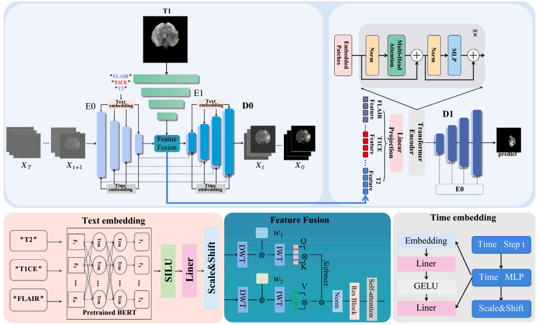








Nice to meet you! I’m Jie Wang, currently a PhD student at the School of Computer Science, University of Nottingham. I previously graduated from the University of Manchester and Donghua University. My research interests include large multimodal models and medical imaging. I have published papers in several top-tier journals and conferences, including Nature Communications (NC), Medical Image Analysis (MIA), Applied Soft Computing (ASOC), MICCAI.

# 🔥 News
- *2025.11*: &nbsp; 🎉 One paper has been accepted to the Applied Soft Computing (ASOC, Q1, TOP, IF: 6.6).
- *2025.09*: &nbsp; 🎉 One paper has been accepted to the Nature Communications (NC, Q1, TOP, IF: 15.7).
- *2025.06*: &nbsp; Become a PhD student. 

# 📝 Publications 

Nature Communications

[Development of deep learning-based narrow-band imaging endocytoscopic classification for predicting colorectal lesions from a retrospective study](https://www.nature.com/articles/s41467-025-63812-5?utm_source=rct_congratemailt&utm_medium=email&utm_campaign=oa_20250924&utm_content=10.1038/s41467-025-63812-5)

**Jie Wang**, Mingqing Liu, Haiming Liao, Jiawei Fan, He Zhu, Tantan Ma, Dong Yang, Fengming Ni, Fan Zhang, Guohua Jin, Juan Yu, Jiahui He, Xiaokun Liang, Nan Zhang, Hong Xu, Zhicheng Zhang

- We present a computer-aided diagnosis (CAD) model for colorectal lesion classification using narrow-band imaging endocytoscopy (EC-NBI). Inspired by progressive pre-training strategies in large language models, our approach integrates generalized and in-domain pre-training with supervised deep clustering. Evaluated on an independent cohort, the model outperforms state-of-the-art supervised methods at both image and lesion levels, surpassing even experienced endoscopists in human–machine competitions. By enhancing diagnostic accuracy and consistency, this CAD system advances the clinical utility of EC-NBI and supports the goal of optical biopsy.

Applied Soft Computing

[Advancing brain tumor segmentation in smart healthcare via T1-generated virtual multimodal MRI fusion](https://www.sciencedirect.com/science/article/pii/S1568494625015911)

Youjian Zhang*, **Jie Wang\***, Xinquan Yang, Xinyuan Zhang, Abudoukeyoumujiang Abulizi, Hong Jiang, Guanqun Zhou, Haiming Liao, Gang Yu, Zhicheng Zhang

- Precision segmentation of brain tumors is crucial for diagnosis, treatment, and prognosis in smart healthcare. While traditional single-modality methods have performance limitations, multimodal segmentation, though more accurate, increases patient scanning time and strains medical resources. This paper introduces a novel approach using a denoising diffusion probabilistic models to generate virtual T2, T1CE, and FLAIR images from singlemodality T1, enhancing segmentation without additional scans. By concurrently training the generation and segmentation networks, we achieve realistic multimodal images and precise tumor segmentation. Experiments show our method significantly outperforms single-modality techniques and rivals real multimodal segmentation, reducing the need for multimodal images, optimizing resource use, and offering an alternative for patients unable to receive contrast enhancers.

# 🏫 Affiliations
- University of Nottingham
- Shenzhen University
- The first hospital of Jilin University
- University of Manchester
- Donghua University
- Shenzhen Institute of Advanced Technology，Chinese Academy of Sciences

# 💻 Professional Service
### Reviewer of journals : TIP, TMI, MIA, Scientific data
### Reviewer of conferences : AAAI, MICCAI, ICDM, ICASSP, ICPR